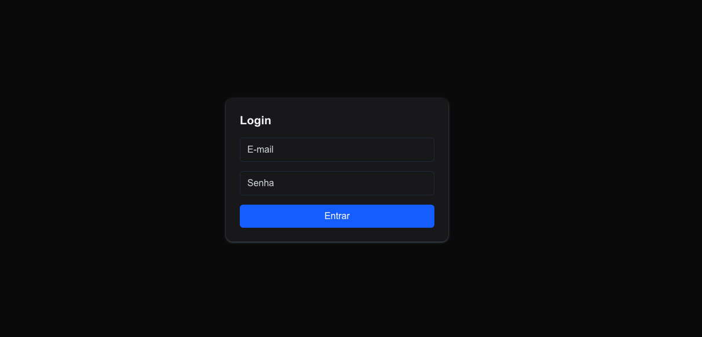
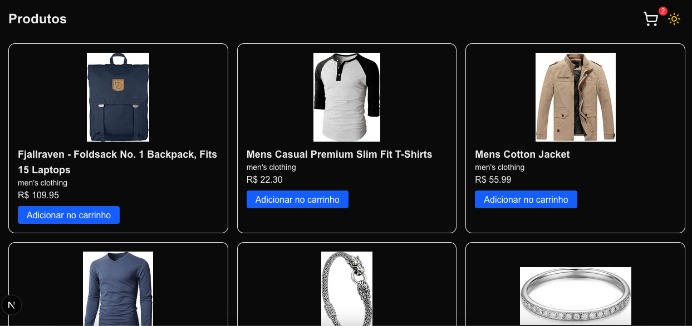
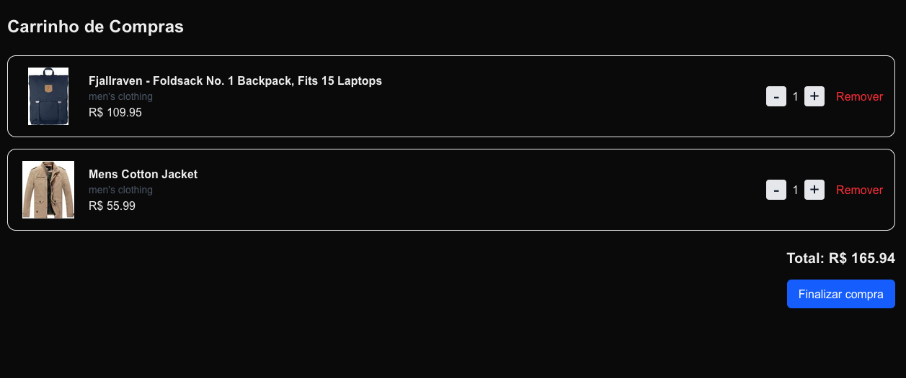

# 🛍️ My Store - E-commerce

Uma loja online fictícia construída com **Next.js 14**, **Tailwind CSS**, **Zustand**, **React Hook Form**, **Zod**, **Vitest**, **Playwright** e outras ferramentas modernas.


**Demonstração:**

<p align="center">
  
  
  
</p>

Inclui recursos como:

* Login com simulação de autenticação
* Listagem de produtos
* Carrinho de compras com gerenciamento global
* Checkout com simulação de pagamento
* Tema claro/escuro com toggle
* Acessibilidade, boas práticas e SEO
* Testes automatizados e acessibilidade auditada com Lighthouse

---

## 🧰 Tecnologias e Ferramentas

| Categoria              | Tecnologias |
|------------------------|-------------|
| **Framework**          | [Next.js](https://nextjs.org/) (App Router) |
| **Linguagem**          | [TypeScript](https://www.typescriptlang.org/) |
| **Estilização**        | [Tailwind CSS](https://tailwindcss.com/), CSS custom |
| **Validação**          | [React Hook Form](https://react-hook-form.com/), [Zod](https://zod.dev/) |
| **Gerenciamento de estado** | [Zustand](https://zustand-demo.pmnd.rs/) |
| **Testes**             | [Vitest](https://vitest.dev/), [React Testing Library](https://testing-library.com/), [Playwright](https://playwright.dev/) |
| **Mock API** (opcional) | [MSW](https://mswjs.io/) (ainda não utilizado) |
| **Feedback/Toast**     | [Sonner](https://ui.shadcn.dev/docs/components/sonner) |
| **Segurança**          | [next-secure-headers](https://www.npmjs.com/package/next-secure-headers) |
| **Ícones**             | [Lucide Icons](https://lucide.dev/) |

---

## 📦 Funcionalidades

* [x] Login com validação de formulário
* [x] Proteção de rotas via middleware
* [x] Listagem de produtos com carregamento dinâmico
* [x] Carrinho persistente com Zustand
* [x] Feedback de adição no carrinho (toast + badge)
* [x] Página de Checkout com simulação de pagamento
* [x] Tema light/dark com toggle persistido
* [x] Totalmente responsivo e acessível

---

## ✅ Lighthouse Scores

| Métrica            | Resultado |
| ------------------ | --------- |
| **Performance**    | 70+       |
| **Acessibilidade** | 100       |
| **Boas Práticas**  | 96        |
| **SEO**            | 100       |

---

## 📂 Estrutura de Pastas

```bash
src/
├── __tests__/              # Testes unitários e E2E
│── actions/              # Actions
│── app/                # Rotas (Login, Dashboard, Cart, Checkout)
├── components/         # Componentes reutilizáveis (Product, Navbar etc)
├── context/           # Contextos (useAuth, useProducts)
├── hooks/              # Hooks customizados (useAuth, useProducts)
├── lib/                # Zustand stores, utilitários
├── test/              # Setup tests
├── validations/        # Schemas do Zod
└── middleware.ts       # Proteção de rotas com cookies
```

---

## 🧪 Testes

* Testes unitários com **Vitest** (`Product`, `Cart`, `LoginForm`, etc.)
* Testes de integração com formulário de login e checkout
* Testes E2E com **Playwright**
* Cobertura das principais interações do usuário

---

## 🎨 Tema Light/Dark

* Toggle no header
* Implementado com `next-themes`
* Tailwind configurado com `darkMode: 'class'`
* Persistência em `localStorage`

---

## 🛒 Como rodar localmente

```bash
# Instalar dependências
npm install

# Rodar servidor local
npm run dev

# Rodar testes unitários
npm run test

# Rodar testes E2E com Playwright
npx playwright test
```

---

## 🔐 Middleware de Autenticação

Utiliza `auth-token` via cookies para proteger as rotas privadas (`/dashboard`, `/cart`, `/checkout`).

---

## 📌 Futuras melhorias

* Integração com API real (como Stripe ou fakestoreapi)
* Dashboard do admin
* Histórico de pedidos
* CI com GitHub Actions
* Deploy com Vercel

---

## 👨‍💻 Autor

> Feito com ❤️ por \[Seu Nome ou @GitHub]

---

### 📝 Licença

Este projeto está licenciado sob a licença MIT. Sinta-se livre para usar, contribuir e adaptar!


